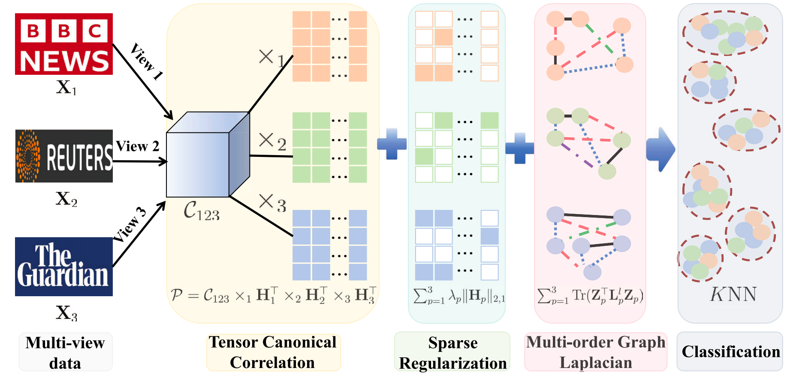

# TCCA

The code in this toolbox implements ["Sparse Tensor CCA via Manifold Optimization for Multi-View Learning"](https://ieeexplore.ieee.org/abstract/document/11296916) by <i>Y. Zhu, W. Liu, X. Xiu, J. Sun</i>.

### Testing
Directly run demo.m for reproduction.

### Citation
Please give credits to this paper if this code is useful and helpful for your research.

     @article{zhu2025sparse,
      title     = {Sparse Tensor CCA via Manifold Optimization for Multi-View Learning},
      author    = {Zhu, Yanjiao and Liu, Wanquan and Xiu, Xianchao and Sun, Jianqin},
      journal   = {IEEE Transactions on Circuits and Systems for Video Technology},
      year      = {2026},
      volume    = {36},
      number    = {5},
      pages     = {6299-6313},
      publisher = {IEEE}
     }

